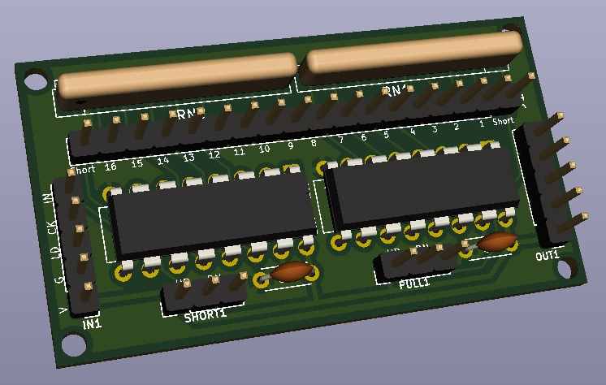
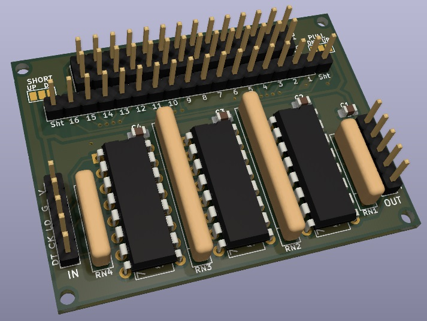
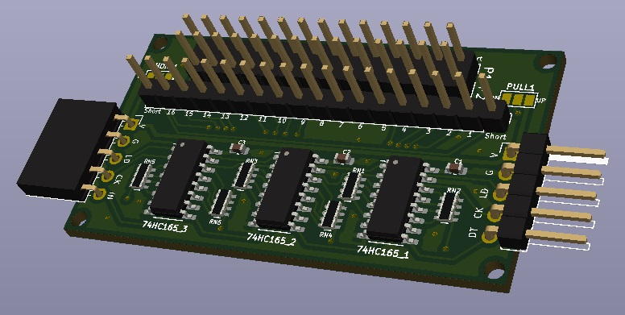
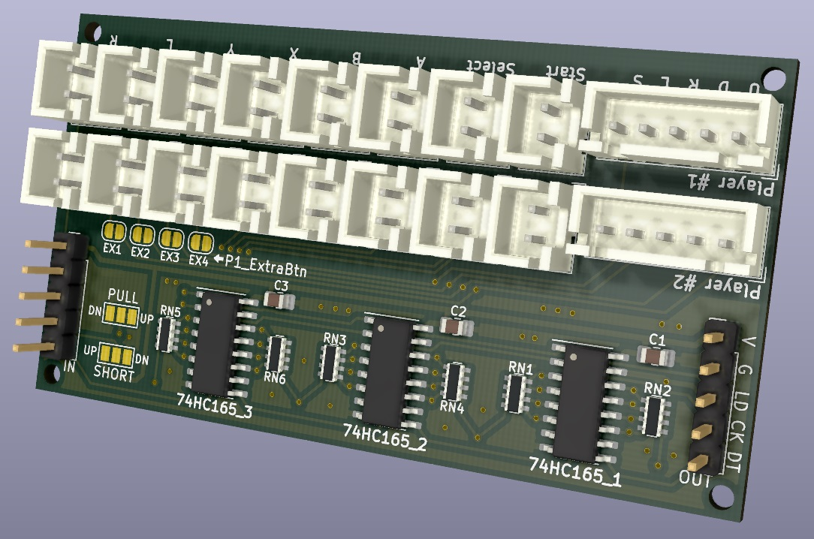

# Arcade Joystick 입력 장치

---

[74HC165를 사용한 Arcade Joystick 입력 보드 (DIP. 1P Ver.)](joystick_74hc165_input_1p/)
([README.md](joystick_74hc165_input_1p/README.md))

---

[74HC165를 사용한 Arcade Joystick 입력 보드 (DIP. 2P Ver.)](joystick_74hc165_input/)
([README.md](joystick_74hc165_input/README.md))

---

[74HC165를 사용한 Arcade Joystick 입력 보드 (SMD. 2P Ver.)](joystick_74hc165_input_smd/)
([README.md](joystick_74hc165_input_smd/README.md))

---

[74HC165를 사용한 Arcade Joystick 입력 보드 (JST 커넥터. 2P Ver)](joystick_74hc165_input_jst/)
([README.md](joystick_74hc165_input_jst/README.md))

---

[Raspberry Pie GPIO 입력 모듈](joystick_gpio_input/)
([README.md](joystick_gpio_input/README.md))

---
