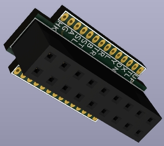
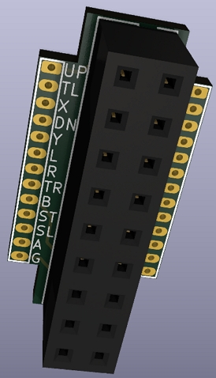

# Raspberry Pie GPIO 입력 모듈

GPIO 보호 기능을 갖는 입력 모듈

---
mk_arcade_joystick_rpi의 GPIO 입력 맵을 기본으로 했다.

am_joyin 드라이버도 해당 GPIO 입력 맵과 호환된다.

기본적으로는 1P를 기준으로 했으며, 2P 용으로는 GPIO를 모두 소진한다는 문제 때문에 2P는 optional 하게 추가 지원하도록 했다.

1P의 경우, HK를 GPIO11로 사용하게 했는데, 이를 원활히 사용하려면 am_joyin 드라이버를 쓰면 된다.

> ***info***  
am_joyin 링크 : [https://github.com/amos42/am_joyin](https://github.com/amos42/am_joyin)

## 메인 파트

### 회로도

### PCB

### BOM

| Designator | Package           | Quantity | Designation |
|------------|-------------------|----------|-------------|
| R1~R13     | R_0805_2012Metric | 13       | 6.8K        |

### 샘플 이미지

---

## Raspberry Pi Connector 1P 파트

### 회로도

### PCB

### 샘플 이미지

---

## Raspberry Pi Connector 2p 파트

### 회로도

### PCB

### 샘플 이미지

## 점퍼 세팅

커넥터 중 J3는 일부 핀을 점퍼 세팅으로 변경이 가능하다.

* *R - 1-2 끊고 2-3 쇼트시, J3의 Right 핀이 GND로 쇼트
* *SL - 1-2 끊고 2-3 쇼트시, J3의 Select 핀이 GND로 쇼트
* *HK - 1-2 끊고 2-3 쇼트시, J3의 HotKey 핀이 GND로 쇼트
